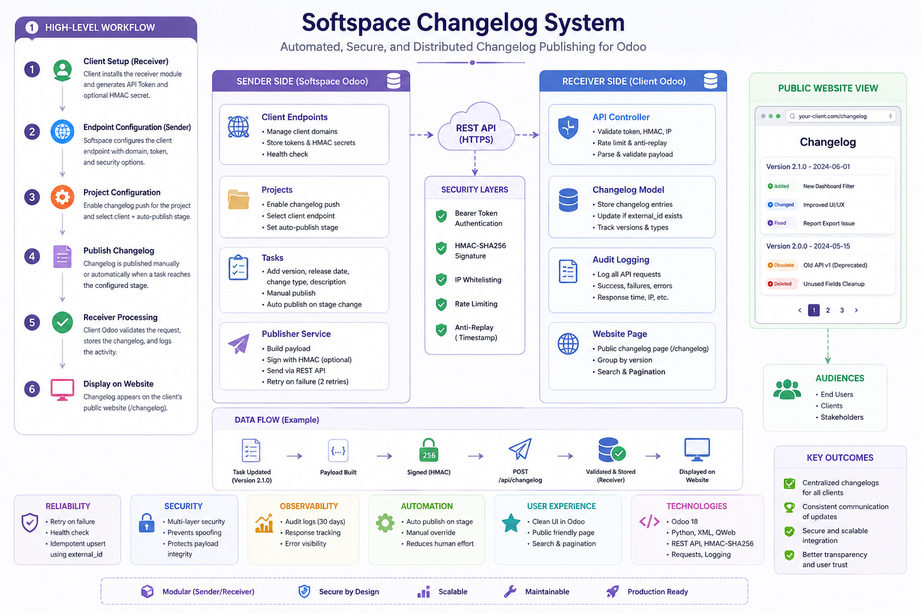

# Softspace Changelog System

Odoo modules for publishing changelog entries from Softspace to client Odoo instances.

## Architecture

<p align="center">
  
</p>

## Modules

### softspace_changelog_sender
Installed on **Softspace Odoo** (the company that manages projects).

- Manage client endpoints (domain, token, HMAC)
- Publish changelogs from project tasks (manual or auto on stage change)
- Health check for client connectivity
- Retry on failure (2 retries with 2s delay)

### softspace_changelog_receiver
Installed on **each Client Odoo** (hager, uapp, etc.).

- Receive changelogs via REST API (`POST /api/changelog`)
- Display on public page (`/changelog`)
- Bearer token + optional HMAC-SHA256 authentication
- Rate limiting, IP whitelist, anti-replay protection
- API audit logging with auto-cleanup (30 days)
- Settings UI for token/security configuration

## Setup Flow

### On Client Odoo (Receiver):
1. Install `softspace_changelog_receiver`
2. Go to **Softspace → API Settings**
3. Click **Generate New Token** → copy it
4. Save

### On Softspace Odoo (Sender):
1. Install `softspace_changelog_sender`
2. Go to **Softspace → Client Endpoints → New**
3. Enter client domain + paste the token
4. Click **Check Health** → should show Healthy
5. Go to any **Project → Settings** → enable Changelog Push → select client
6. Open a **Task → Changelog tab** → set Version → click **Publish Changelog**

### Result:
- Changelog appears in client's backend (**Softspace → Changelogs**)
- Changelog appears on client's public page (`https://client-domain.com/changelog`)

## Testing

21 unit tests (11 sender + 10 receiver) — all passing on Odoo 18.

```bash
python odoo-bin --addons-path=addons,odoo/addons -d testdb \
  -u softspace_changelog_sender,softspace_changelog_receiver \
  --test-enable --stop-after-init
```

## Version

- Branch `18.0`: Odoo 18 (v18.0.1.0.0)
